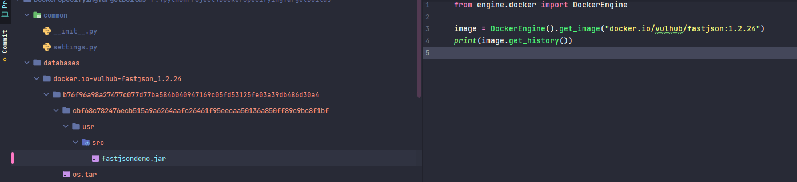
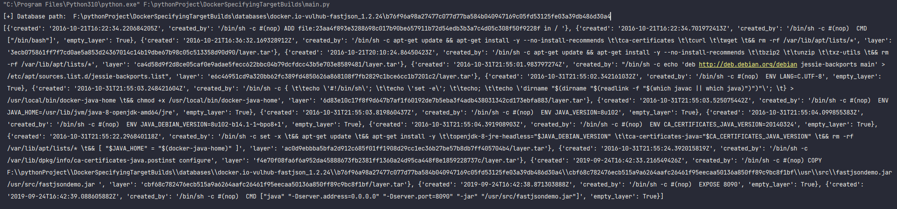

# 简介

DockerHistorySpecifying 可以帮助你拿到 history 中手动 ADD 与 COPY 的文件

# 使用

安装 python docker

```shell
pip install -r requirement.txt
```

配置 Docker 地址, 在 `common/settings` 中, 因为解析过程中会设计下载镜像, 所以速度受镜像的大小影响, 因此讲 TIMOUT 设置大点。

```python
DOCKER = {
    # 是否连接本地的 Docker
    "LOCAL": False,
    
    # 当 LOCAL 选项为 FALSE 时, 会使用远程 API
    "REMOTE": {
        'URL': 'tcp://192.168.157.133:2375',
        'TIMEOUT': 999,
    }
}
```

Main 中的示例代码, 方法 `get_image()` 参数填写镜像tag, 运行代码即可在项目根目录下

```python
from engine.docker import DockerEngine

image = DockerEngine().get_image("docker.io/vulhub/fastjson:1.2.24")
print(image.get_history())
```



输出


